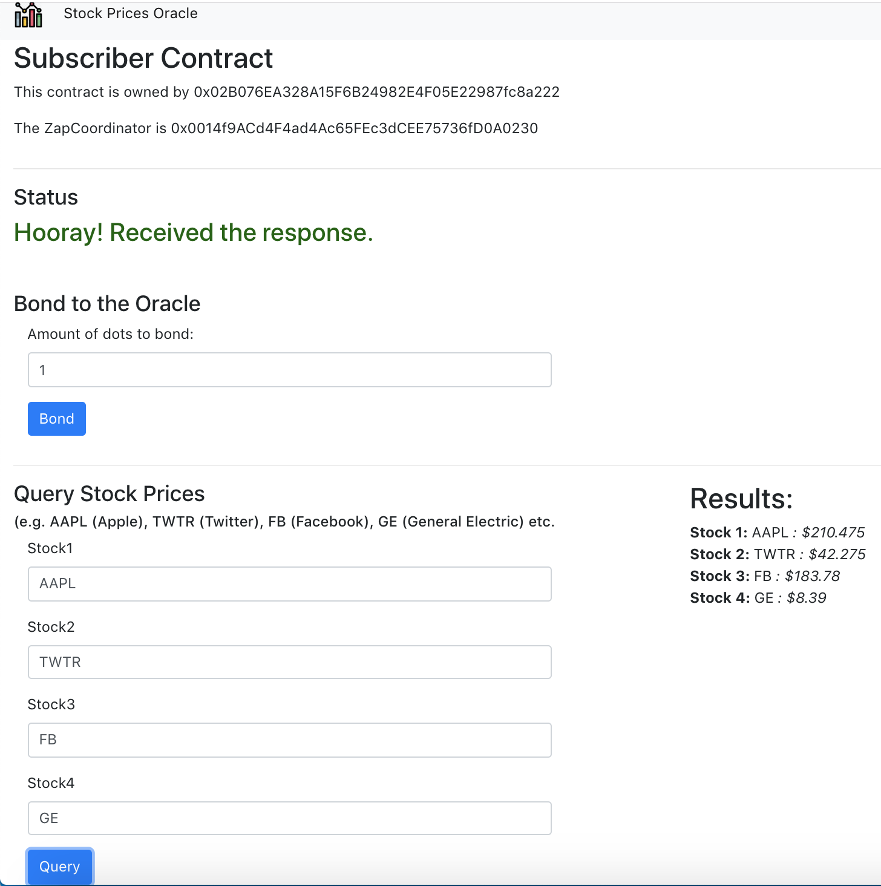
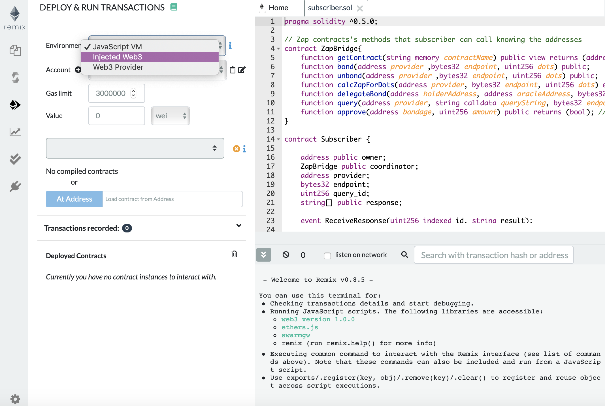

# oracle-market
This is a demo frontend application that uses a smart contract to query an oracle and display the results to the end-users. The users can bond dots to the oracle and get the current stock rates for various stocks such as Apple (AAPL), Twitter (TWTR) etc.

# API used: 
- https://financialmodelingprep.com/api/v3/stock/real-time-price

# How to run this project:
 - `git clone https://github.com/hadiahameed/oracle-market.git`
 - `cd stocks-oracle`
 - `yarn`
 - `npm start` and let it run
 - In a different terminal, `cd oracle-frontend`
 - `cd oracle-frontend`
 - `yarn`
 - `npm start`
 - The webpage will open in your browser.
 - It will prompt you to connect to your MetaMask account.
 - Amount of dots to bond: 1 (if you want to query the oracle once)
 - Wait for the status to say, "Great! You are ready to go."
 - Stock1: "AAPL" (to get Apple's stock price)
 - Stock2: "FB" (to get Facebook's stock price)
 - Stock3: "TWTR" (to get Twitter's stock price)
 - Stock4: "MSFT" (to get Microsoft's stock price)
 - Click on "Query"
 - Wait for the status to say, "Hooray! Received the response."
 - You can see the stock prices in the results section.

 # Project Tutorial:
There are two parts to this tutorial:
1) Creating an off-chain oracle
2) Creating a smart contract that queries the oracle

- Make an empty folder `oracle-market`
### Creating an Oracle
- `mkdir stocks-oracle`
- Use the following tutorial to make an oracle: https://github.com/hadiahameed/zap-oracle-template

### Creating a smart contract
- `mkdir smart-contract`
- Run `git clone https://github.com/zapproject/subscriber-template`
- The contract functions are in contracts/subscriber.sol
- Deploying the contract on Remix: https://remix.ethereum.org and use 'Injected Web3 environment' for deployment.

- Copy the contract address and abi into `oracle-frontend/src/subscriber.js`. That's how we were able to access the contract's functions in our javascript.

Happy Coding!

